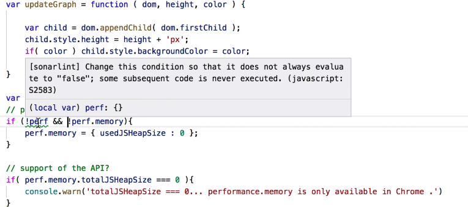
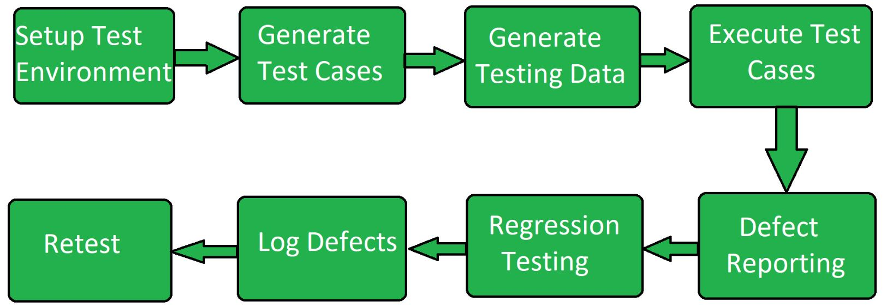
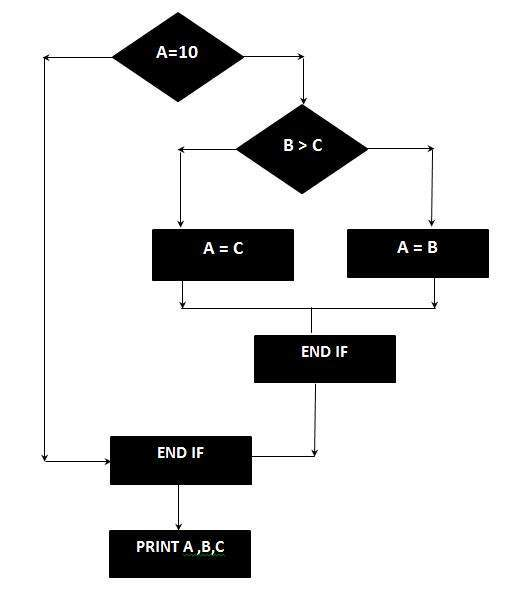
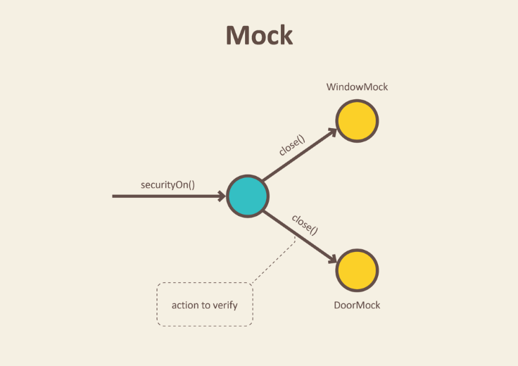
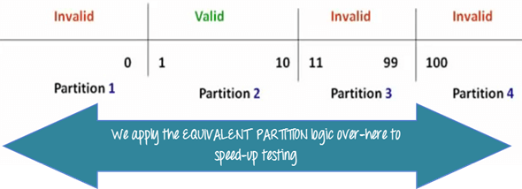
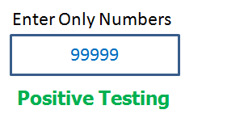
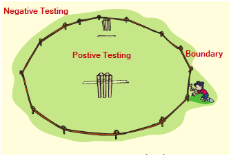
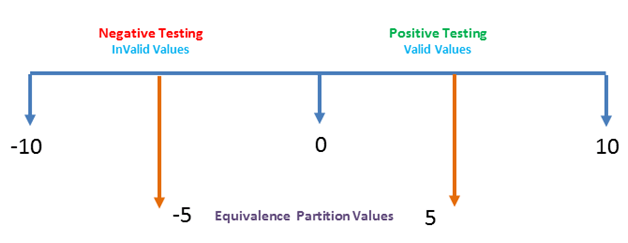
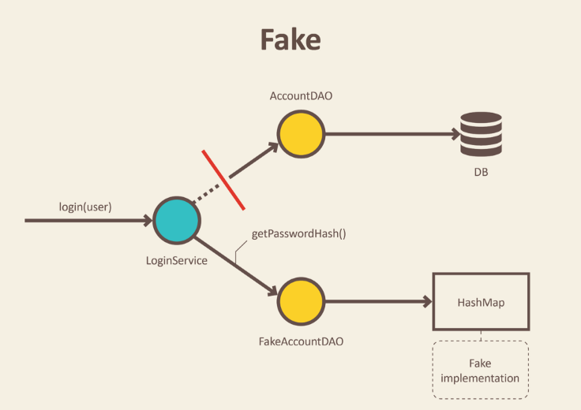
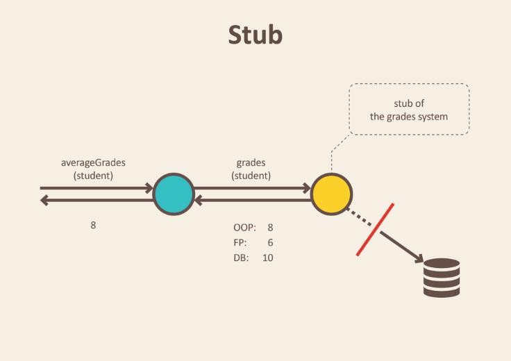

# Exam Question Keywords - Thomas Ebsen

- [Exam Question Keywords - Thomas Ebsen](#exam-question-keywords---thomas-ebsen)
  * [1.1 We have looked at some static analysis tools like StyleCop, PMD, FindBugs and SonarLint. Explain how static analysis can improve code quality. Explain how it helped you or could have helped you in your project</h1>](#11-we-have-looked-at-some-static-analysis-tools-like-stylecop--pmd--findbugs-and-sonarlint-explain-how-static-analysis-can-improve-code-quality-explain-how-it-helped-you-or-could-have-helped-you-in-your-project--h1-)
    + [STATIC ANALYSIS - NO CODE REQUIRED</b>](#static-analysis---no-code-required--b-)
      - [StyleCop, PMD, FindBugs](#stylecop--pmd--findbugs)
      - [Linters, SonarLint](#linters--sonarlint)
      - [Security](#security)
      - [Code Smells](#code-smells)
      - [Technical Debt](#technical-debt)
  * [1.2 Explain test levels, and what characterizes the individual levels. Then, relate to your own project.](#12-explain-test-levels--and-what-characterizes-the-individual-levels-then--relate-to-your-own-project)
      - [Unit Testing - <a href="https://github.com/SOFT2020-Test/Assignment-3/tree/main/src/test/java/unit/servicelayer">Assignment-3</a>](#unit-testing----a-href--https---githubcom-soft2020-test-assignment-3-tree-main-src-test-java-unit-servicelayer--assignment-3--a-)
      - [Integration Testing - <a href="https://github.com/SOFT2020-Test/Assignment-3/tree/main/src/test/java/integration">Assignment-3</a>](#integration-testing----a-href--https---githubcom-soft2020-test-assignment-3-tree-main-src-test-java-integration--assignment-3--a-)
      - [System Testing](#system-testing)
      - [Acceptance Testing](#acceptance-testing)
  * [1.3 Explain what kinds of test can be carried out without running any code. Explain how it can be used on non-code documents as well.](#13-explain-what-kinds-of-test-can-be-carried-out-without-running-any-code-explain-how-it-can-be-used-on-non-code-documents-as-well)

 
## 1.1 We have looked at some static analysis tools like StyleCop, PMD, FindBugs and SonarLint. Explain how static analysis can improve code quality. Explain how it helped you or could have helped you in your project</h1>   
### STATIC ANALYSIS - NO CODE REQUIRED

- #### StyleCop, PMD, FindBugs
    - SonarQube use all the above
    - Analyze code and find bugs
    - Made me change console print to logs (blocking call)
- #### Linters, SonarLint
    - Improve code as you write it - Live code correction
    - Decrease need of refactoring
    - Easy to spot mistakes / bugs  
    <br>  
    - 
- #### Security
    - Static application security testing (SAST)
    - Highlight Security Vulnerabilities
    - Whitebox Testing
    - Runtime Vulnerabilities
- #### Code Smells
    - NOT BUGS
    - Indicate violation of fundamentals
    - Code might work, but setup is flawed
    - Fix unused variables (dead stores), wasted processor time and memory
    - Cleanup code, make it run more smooth
- #### Technical Debt
    - Agile Manifesto
    - Cost of rework / refactoring
     - Cruft
        - badly designed code
        - unnecessarily complicated code
        - unwanted code  
        <br>
    - 

## 1.2 Explain test levels, and what characterizes the individual levels. Then, relate to your own project.
- #### Unit Testing - <a href="https://github.com/SOFT2020-Test/Assignment-3/tree/main/src/test/java/unit/servicelayer">Assignment-3</a>
    - Testing software components
    - Testing functionality
    - Validate that the programs units are working as intended

- #### Integration Testing - <a href="https://github.com/SOFT2020-Test/Assignment-3/tree/main/src/test/java/integration">Assignment-3</a>
    - Test data flow from one module to another
    - E.g. test that a customer is created and stored in database
    - Test integration between program and database
    - Unit vs Integration  
    <br>
    - 
- #### System Testing
    - Evaluate Functional and Non-Functional needs for testing
    - Test the system as a whole
    - It is **Black Box** Testing
    - Testing Types
        - Performance Testing
        - Load Testing
        - Stress Testing
        - Scalability Testing
    - Testing Process
        - Test Environment Setup ->
        - Create Test Case ->
        - Create Test Data ->
        - Defect Reporting ->
        - Regression Testing ->
        - Log Defects ->
        - Retest     
        <br>
    - 
- #### Acceptance Testing
    - Method
        - Manual Black Box Testing following:
        - Ad-hoc testing** aka Monkey Testing || Random Testing
            - Testing random inputs
            - Try to crash program
    - Task
        - Acceptance Test [Execute >> Re-execute]
        - Fourth & Last layer of testing before production
    - Test Types
        - Internal Acceptance Testing
            - Alpha Testing - Performed by developer (in house)
        - External Acceptance Testing
            - Non-Developer - Performed by external people
        - Customer Acceptance Testing
            - Testing performed by the customers of the software (the one buying it / having it developed)
        - User Acceptance Testing (UAT)
            - Beta Testing - Performed by end users 

## 1.3 Explain what kinds of test can be carried out without running any code. Explain how it can be used on non-code documents as well.
- #### Reviews
    - Visually inspect code for bugs
    - Pair Programming (XP)
- #### Technical reviews
    - Less formal review
    - Done by Moderator & Technical Expert
    - Peer Review (done by more people)
    - Find defects
    - Purpose
        - Ensure technical concepts are used correctly
        - To maintain consistency
        - Quality Insurance
    - What to review
        - Customer Feedback
        - Audit Findings
        - Internal / External issues
        - Process, performance, 
- ### Management reviews
    - Formal Review
    - Involves Top Management
    - Every 3, 6 or 12 month
- ### Audit
    - Analyze Source Code
    - Discover Bugs
    - Discover Security Breaches
    - Discover Code Violation
    - Defensive Programming
    - **High-Risk Vulnerabilities**
        - Faults that compromise security
        - No Input Validation (Prepared Statements)
        - etc
    - **Low-Risk Vulnerabilities**
        - Cross-Site-Scripting
        - Enumeration Attack (check if user exist in db)
        - Directory Traversal
            - Read files on server
            - Stacktrace printed on errors
            - etc
- ### Static analysis
    - <a href="#11-we-have-looked-at-some-static-analysis-tools-like-stylecop-pmd-findbugs-and-sonarlint-explain-how-static-analysis-can-improve-code-quality-explain-how-it-helped-you-or-could-have-helped-you-in-your-project">Here</a>
- ### Linters
    - <a href="#linters-sonarlint">Here</a>  

## 1.4 Explain test activities, and how they are related to each other. Then explain the test activities you carried out in your project.  
- ### Unit Testing
    - Testing software components
    - Testing functionality
    - Validate that the programs units are working as intended
- ### Integration Testing
    - Test data flow from one module to another
    - E.g. test that a customer is created and stored in database
    - Test integration between program and database
    - Unit vs Integration  
- ### Refactoring
    - Small changes
    - Fix nested loops
    - Fix name too long
    - Shorten code as much as possible
    - Change internals without fucking externals
    - Optimize, Cleanup, new functionality

- ### Maintenance
    - **Related To Refactoring**
    - Use code standards
    - Write useful comments
    - Documentation
    - Refactoring
- ### Continuous Integration
    - Github Actions
        - Test Passes, Send Message to CI Tool
        - CI Took Pushes to Production
- ### Code Reviews
    - Visually inspect code for bugs
    - Pair Programming (XP)

## 1.5 Testing is related to ensuring higher code quality. Elaborate on what characterizes high code quality, and what makes code testable.
- ### Testable code
    - Interfaces and Classes
    - Code must return verifiable values or in other ways be verifiable
    - Must return specific predictable output
    - Loose coupling / dependency injection
        - Should only be dependable on it-self to work
    - No Global Variables / State Sharing
        - Makes it hard to test if isolated
        - The order of tests should not impact other tests (rip exercise 3 haha)
- ### Names of Tests
    - Naming Conventions
        - Know what test does by its name
        - Name express flow
        - e.g: MethodName_StateUnderTest_ExpectedBehavior : `divideNumbers_divideByZero_ThrowsException`
            - cons: Must be renamed if refactored
            - pros: easy to identify method, state and what to expect
    - Sufficient Test of a method or class
        - Focus on most important classes
        - Test classes that are likely to fail
        - **Risked Based Testing**

- ### Assertion, defensive programming
    - Ensures Code Correctness
    - Reduce number og bugs
    - Use Pre-Conditions
        - Condition must be met before something happens
        - Fail Fast Principle
            - ```java
              public void CreateAppointment(DateTime dateTime) {
                if (dateTime.Date < DateTime.Now.AddDays(1).Date)
                  throw new ArgumentException("Date is too early");
                if (dateTime.Date > DateTime.Now.AddMonths(1).Date)
                  throw new ArgumentException("Date is too late");
                /* Create an appointment */
                } 
              ```
    - Example
        - Bad Code, hard to test, not mockable
         ```java
        public class NewClass {
            public void writeUserToFile(int id) {
                String userName = app.getDbManager().getUserDb().getUserName(id);
                try (FileWriter writer = new FileWriter("user.txt")) {
                    writer.write(userName);
                }
            }
        }
        ```   
        - Better code, easier to test, mockable
        ```java
        public class NewClass {
            private final UserDatabase _userDb;
            public NewClass(final UserDatabase userDb) {
                _userDb = userDb;
            }
            public void writeUserToFile(int id, Writer) {
                private final String userName = this._userDb.getUserName(id);
                writer.write(userName);
            }
        }
        ```
    
- ### Dependency Injection (Inversion of Control)
    **Meaning: Import objects and functions from other classes**  
    This makes the project loosely coupled, which also makes it easier to refactor if changes is needed.  
    - Allows for low coupling
    - Types of dependency injection
        - Constructor Injection
        - Setter Injection
        - Interface Injection
    - Responsible for
        - Creating objects
        - Know which classes require objects
        - Provide objects
    - Example:
        `@AutoWired, @Inject, @RestController, import java.util.logging.logger, constructor, etc`
    - Pros
        - Helps Unit Testing
        - Less boilerplate code
            - dependencies is done by the injector component
        - Easier to extend application
        - Helps enabling loose coupling
    - Cons
        - Complex and Hard to understand
        - Compile errors pushed to runtime errors

- ### 1.6 Explain the concept of maintainable code, and how it’s related to test. Explain how to find out if a code base is maintainable.  
    **Maintainable code is basically the amount of time it takes a developer to make a change and the amount of risk that the change could break something.**    
    Formula: **TimeToImplement / Risk**
- ### Maintainability
    - Formula: TimeToImplement / Risk
    - Better Tests + Code = faster changes & less bugs
- ### Product quality
    - Have code standards
    - Self explanatory code
    - Readable Comments
    - Reliable Program
    - No or low bugs
    - Usability / Easy to use
    - Easy to expand, low coupling high cohesion
- ### Temporal coupling
    - Code depends on time in some way
    - Timer should be moved to interface
    - Serious code smell
    - Example
        - Bad
            ```java
            public class Bank {
                public void transferFunds(Account from, Account to, float amount) {
                    var t0 = System.nanoTime(); //Time when starting the transfer
                    from.deduct(amount);
                    to.add(amount);
                    var t1 = System.nanoTime(); //Time after transfer
                    if(t1 - t0 > 100000) {
                        maintenance.alertSlow(); //Transfer is slow
                    }
                }
            }
            ```
        - Good
             ```java
            public Interface Timer {
                long nanoTime();
            }
            public class Bank {
                public void transferFunds(Account from, Account to, float amount, Timer timer) {
                    var t0 = timer.nanoTime(); //Time before transfer, from interface
                    from.deduct(amount);
                    to.add(amount);
                    var t1 = timer.nanoTime(); //Time after transfer, from interface
                    if(t1 - t0 > 100000) {
                        maintenance.alertSlow(); //Transfer is slow
                    }
                }
            }
            ```
- ### Continuous Integration
    - Github Actions (. . .)
    - Test Passes, Send Message to CI Tool
    - CI Took Pushes to Production
- ### Static Analysis
    - <a href="#11-we-have-looked-at-some-static-analysis-tools-like-stylecop-pmd-findbugs-and-sonarlint-explain-how-static-analysis-can-improve-code-quality-explain-how-it-helped-you-or-could-have-helped-you-in-your-project">Here</a>
- ### Dependency injection, inversion of control
    **Meaning: Import objects and functions from other classes**
    - Allows for low coupling
    - Types of dependency injection
        - Constructor Injection
        - Setter Injection
        - Interface Injection
    - Responsible for
        - Creating objects
        - Know which classes require objects
        - Provide objects
    - Example:
        `@AutoWired, @Inject, @RestController, import java.util.logging.logger, constructor, etc`
    - Pros
        - Helps Unit Testing
        - Less boilerplate code
            - dependencies is done by the injector component
        - Easier to extend application
        - Helps enabling loose coupling
    - Cons
        - Complex and Hard to understand
        - Compile errors pushed to runtime errors

- ### Low coupling, high cohesion
    - **High cohesion:** Elements within one class/module should functionally belong together and do one particular thing.
    - **Loose coupling:** Among different classes/modules should be minimal dependency.
    - Code can be changed without refactoring
    - Code can be changed without changing other functions/classes
    - Easy refactoring, less mess, not crashing system

- ### Cyclomatic code complexity
    - Limit Code Complexity
    - Find how many test cases required
    - Create **FLOW GRAPH DIAGRAM**
    - Formula: `E - N + P*2`  
        `E = Number of edges`  
        `N = Number of nodes`  
        `P = Number of nodes with exit points`  
    - Example
        ```java
        if(A = 10) {
            if(B > C) {
                A = B;
            } else {
                A = C;
            }
        }
        print(A)
        print(B)
        print(C)
        ```  
        

## 1.7 Explain unit testing, and what characterizes it in contrast to other types of test.
- ### What and Why?
    To ensure code quality and that units works
    - Testing software components
    - Testing functionality
    - Validate that the programs units are working as intended
- ### Unit Under Test / System Under Test
    - **UUT - Unit Under Test**
        - Object that is being tested
        - jUnit Testing
    - **SUT - System Under Test**
        - The Whole System Being Tested
        - Test for correct operation
        - SUT comes after Integration Testing - <a href="#system-testing">Here</a>
- ### Unit test lifecycle(BeforeAll, AfterAll / SetUp, TearDown)
    - @BeforeAll
        - Execute before all test classes
            ```java
            // SUT (System Under Test)
            private CustomerService customerService;
            // DOC (Depended-on Component)
            private CustomerStorage storageMock;
            private Faker faker;
            
            @BeforeAll
            public void beforeAll(){
            storageMock = mock(CustomerStorage.class);
            customerService = new CustomerServiceImpl(storageMock);
            faker = new Faker();
            }
            ```
    - @AfterAll
        - Execute after all tests
            ```java
            _dbConnection.close();
            ```
- ### Test Doubles (mock, fake, sub, py)
    Test Doubles = Mocking / Dummy Data
    - Mockito
        ```java
        public void mustCallStorageWhenCreatingCustomer() {
          // Arrange
          // Act
          var firstName = "a";
          var lastName = "b";
          var phonenumber = "12345678";
          var birthdate = faker.date().birthday();
          customerService.createCustomer(firstName, lastName, birthdate, phonenumber);

          // Assert
          // Can be read like: verify that storageMock was called 1 time on the method
          // 'createCustomer' with an argument whose 'firstname' == firstName and
          // whose 'lastname' == lastName
          verify(storageMock, times(1))
            .createCustomer(
              argThat(x -> x.firstname.equals(firstName) &&
                        x.lastname.equals(lastName)));
        }
        ```
         
    - Faker
        Dependency that provides fake dummy data

- ### Test Driven Development (TDD)
    - Make tests before writing code
    - Tests should not change with code
    - Test should continue to pass after refactoring
    - Red, Green, Refactor

- ### Dependency Injection
    - <a href="#dependency-injection-inversion-of-control">Here</a>

- ### Equivalence classes, boundary value analysis, equivalence partitions
    **Black Box Testing**
    - Equivalence Partitioning
        - Can be used on all tests, unit, integration, system, etc.
        - Divide input data into equivalent partitions
        - Reduces time required to test because it is divided (pick which test to run)
        - Used in tests with range of input fields
    - Boundary Value Analysis
        - Same as above
        - `1-10 is VALID`
        - `< 1 = INVALID`
        - `> 10 INVALID`
        - `3 digit number = INVALID`
        - 
    - 
- ## 1.8 Explain test driven development, and how it affects the development process and code quality.
    - ### Red, Green, Refactor
        - Red - Think about **WHAT TO DEVELOP - WRITE FAILING TEST**
        - Green - Think about **HOW TO MAKE TEST PASS**
        - Refactor - Think about **HOW TO IMPROVE EXISTING IMPLEMENTATION**
    - ### Testable code
        - Interfaces and Classes
        - Code must return verifiable values or in other ways be verifiable
        - Must return specific predictable output
        - Loose coupling / dependency injection
        - Should only be dependable on it-self to work
        - No Global Variables / State Sharing
        - Makes it hard to test if isolated
        - The order of tests should not impact other tests (rip exercise 3 haha)
    - ### Maintainable code
        **Maintainable code is basically the amount of time it takes a developer to make a change and the amount of risk that the change could break something.**    
        - Formula: TimeToImplement / Risk
        - Better Tests + Code = faster changes & less bugs
    - ### Equivalence partitions
        - <a href="#equivalence-classes-boundary-value-analysis-equivalence-partitions">Here</a>
    - ### Positive, negative tests
        - Positive Tests
            - Provide valid data
            - Expected to pass
            - Application is expected to behave correctly
            - Example  
                
        - Negative Test
            - Provide invalid data
            - Test expected to fail
            - Ensure app doesn't crash
            - Example  
                
        - Technique
            - Boundary Value Analysis
                
            - Equivalent Partitioning
                

- ### 1.9 Explain about test doubles. Explain how and why mocking is useful, and in what test areas.  
    **Test Double - Think STUNT DOUBLE / MOCK DATA**   
    **Useful when working separate - Frontend / Backend**  
    **Think LSD, we mock data, we have no database** <a href="https://github.com/TEAM-B-SOFT2020/LSDFrontEnd/blob/main/src/contract/ContractMock.ts">[Link TO LSD CONTRACT MOCK]</a>  


    **Mocking** Good for testing Integration
    **Stubs, Fakes, Dummies** Good for unit testing

    - ### Mockito, mocks, spies, stubs, fakes, dummies  
        - **Dummy**
            - Dummy Data / Objects
        - **Fake**
            - Fake data, like in memory db
                
        - **Stubs**
            - Holds pre-defined data
            - Use the data to answer calls during tests
            - Used when we don't want to use objects that would answer with real data
            - Example: Object that needs data from DB to respond to method call
                
        - **Spies** are stubs that also record some information based on how they were called. One form of this might be an email service that records how many messages it was sent.
        - **Mocks** are pre-programmed with expectations which form a specification of the calls they are expected to receive. They can throw an exception if they receive a call they don't expect and are checked during verification to ensure they got all the calls they were expecting
    - ### Dependency injection
        - <a href="#dependency-injection-inversion-of-control">Here</a>
        - Use junit and mockito for testing
        - Example
            ```java
            public class MyApplication {
                private final EmailService email;

                public MyApplication(EmailService email) {
                    this.email = email;
                }

                public boolean processMessages (String msg , String recipient ) {
                    if (msg.length == 0 || recipient.length == 0 ) {
                        return false ;
                    }
                    return this.email.sendEmail (msg , recipient ) ;
                }
            }


            @BeforeEach
            void setup() {
                email = mock(EmailService.class);
                when(email.sendEmail(any(), any())).thenReturn(true);
                app = new MyApplication(email);
            }

            @Test
            void testProcessZeroLengthMessageOrPerson() {
                assertFalse(app.processMessages("", "Person"));
                assertFalse(app.processMessages("Message", "")):
                assertFalse(app.processMessages("", "")):
            }

            @Test
            void testProcessMessage() {
                assertTrue(app.processMessage("Message", "Person"));
                verify(email).sendEmail("Message", "Person");
            }
            ```
    - ### Interfaces, contracts
        - Interfaces - jUnit
    - ### Black-box vs white-box


- ### 1.10 Characterize high quality software. Explain how writing tests can increase code quality. 