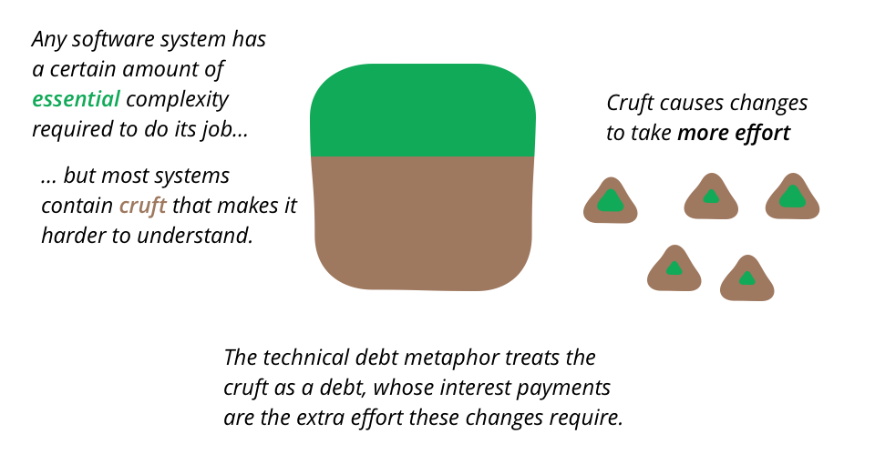

# Exam Question Keywords - Thomas Ebsen

- [Exam Question Keywords - Thomas Ebsen](#exam-question-keywords---thomas-ebsen)
  * [1.1 We have looked at some static analysis tools like StyleCop, PMD, FindBugs and SonarLint. Explain how static analysis can improve code quality. Explain how it helped you or could have helped you in your project</h1>](#11-we-have-looked-at-some-static-analysis-tools-like-stylecop--pmd--findbugs-and-sonarlint-explain-how-static-analysis-can-improve-code-quality-explain-how-it-helped-you-or-could-have-helped-you-in-your-project--h1-)
    + [STATIC ANALYSIS - NO CODE REQUIRED</b>](#static-analysis---no-code-required--b-)
      - [StyleCop, PMD, FindBugs](#stylecop--pmd--findbugs)
      - [Linters, SonarLint](#linters--sonarlint)
      - [Security](#security)
      - [Code Smells](#code-smells)
      - [Technical Debt](#technical-debt)
  * [1.2 Explain test levels, and what characterizes the individual levels. Then, relate to your own project.](#12-explain-test-levels--and-what-characterizes-the-individual-levels-then--relate-to-your-own-project)
      - [Unit Testing - <a href="https://github.com/SOFT2020-Test/Assignment-3/tree/main/src/test/java/unit/servicelayer">Assignment-3</a>](#unit-testing----a-href--https---githubcom-soft2020-test-assignment-3-tree-main-src-test-java-unit-servicelayer--assignment-3--a-)
      - [Integration Testing - <a href="https://github.com/SOFT2020-Test/Assignment-3/tree/main/src/test/java/integration">Assignment-3</a>](#integration-testing----a-href--https---githubcom-soft2020-test-assignment-3-tree-main-src-test-java-integration--assignment-3--a-)
      - [System Testing](#system-testing)
      - [Acceptance Testing](#acceptance-testing)
  * [1.3 Explain what kinds of test can be carried out without running any code. Explain how it can be used on non-code documents as well.](#13-explain-what-kinds-of-test-can-be-carried-out-without-running-any-code-explain-how-it-can-be-used-on-non-code-documents-as-well)

 
## 1.1 We have looked at some static analysis tools like StyleCop, PMD, FindBugs and SonarLint. Explain how static analysis can improve code quality. Explain how it helped you or could have helped you in your project</h1>   
### STATIC ANALYSIS - NO CODE REQUIRED

- #### StyleCop, PMD, FindBugs
    - SonarQube use all the above
    - Analyze code and find bugs
    - Made me change console print to logs (blocking call)
- #### Linters, SonarLint
    - Improve code as you write it - Live code correction
    - Decrease need of refactoring
    - Easy to spot mistakes / bugs  
    <br>  
    - 
- #### Security
    - Static application security testing (SAST)
    - Highlight Security Vulnerabilities
    - Whitebox Testing
    - Runtime Vulnerabilities
- #### Code Smells
    - NOT BUGS
    - Indicate violation of fundamentals
    - Code might work, but setup is flawed
    - Fix unused variables (dead stores), wasted processor time and memory
    - Cleanup code, make it run more smooth
- #### Technical Debt
    - Agile Manifesto
    - Cost of rework / refactoring
     - Cruft
        - badly designed code
        - unnecessarily complicated code
        - unwanted code  
        <br>
    - 

## 1.2 Explain test levels, and what characterizes the individual levels. Then, relate to your own project.
- #### Unit Testing - <a href="https://github.com/SOFT2020-Test/Assignment-3/tree/main/src/test/java/unit/servicelayer">Assignment-3</a>
    - Testing software components
    - Testing functionality
    - Validate that the programs units are working as intended

- #### Integration Testing - <a href="https://github.com/SOFT2020-Test/Assignment-3/tree/main/src/test/java/integration">Assignment-3</a>
    - Test data flow from one module to another
    - E.g. test that a customer is created and stored in database
    - Test integration between program and database
    - Unit vs Integration  
    <br>
    - 
- #### System Testing
    - Evaluate Functional and Non-Functional needs for testing
    - Test the system as a whole
    - It is **Black Box** Testing
    - Testing Types
        - Performance Testing
        - Load Testing
        - Stress Testing
        - Scalability Testing
    - Testing Process
        - Test Environment Setup ->
        - Create Test Case ->
        - Create Test Data ->
        - Defect Reporting ->
        - Regression Testing ->
        - Log Defects ->
        - Retest     
        <br>
    - 
- #### Acceptance Testing
    - Method
        - Manual Black Box Testing following:
        - Ad-hoc testing** aka Monkey Testing || Random Testing
            - Testing random inputs
            - Try to crash program
    - Task
        - Acceptance Test [Execute >> Re-execute]
        - Fourth & Last layer of testing before production
    - Test Types
        - Internal Acceptance Testing
            - Alpha Testing - Performed by developer (in house)
        - External Acceptance Testing
            - Non-Developer - Performed by external people
        - Customer Acceptance Testing
            - Testing performed by the customers of the software (the one buying it / having it developed)
        - User Acceptance Testing (UAT)
            - Beta Testing - Performed by end users 

## 1.3 Explain what kinds of test can be carried out without running any code. Explain how it can be used on non-code documents as well.
- #### Reviews
    - Visually inspect code for bugs
    - Pair Programming (XP)
- #### Technical reviews
    - Less formal review
    - Done by Moderator & Technical Expert
    - Peer Review (done by more people)
    - Find defects
    - Purpose
        - Ensure technical concepts are used correctly
        - To maintain consistency
        - Quality Insurance
    - What to review
        - Customer Feedback
        - Audit Findings
        - Internal / External issues
        - Process, performance, 
- ### Management reviews
    - Formal Review
    - Involves Top Management
    - Every 3, 6 or 12 month
- ### Audit
    - Analyze Source Code
    - Discover Bugs
    - Discover Security Breaches
    - Discover Code Violation
    - Defensive Programming
    - **High-Risk Vulnerabilities**
        - Faults that compromise security
        - No Input Validation (Prepared Statements)
        - etc
    - **Low-Risk Vulnerabilities**
        - Cross-Site-Scripting
        - Enumeration Attack (check if user exist in db)
        - Directory Traversal
            - Read files on server
            - Stacktrace printed on errors
            - etc
- ### Static analysis
    - <a href="#11-we-have-looked-at-some-static-analysis-tools-like-stylecop-pmd-findbugs-and-sonarlint-explain-how-static-analysis-can-improve-code-quality-explain-how-it-helped-you-or-could-have-helped-you-in-your-project">Here</a>
- ### Linters
    - <a href="#linters-sonarlint">Here</a>  

## 1.4 Explain test activities, and how they are related to each other. Then explain the test activities you carried out in your project.  
- ### Unit Testing
    - Testing software components
    - Testing functionality
    - Validate that the programs units are working as intended
- ### Integration Testing
    - Test data flow from one module to another
    - E.g. test that a customer is created and stored in database
    - Test integration between program and database
    - Unit vs Integration  
- ### Refactoring
    - Small changes
    - Fix nested loops
    - Fix name too long
    - Shorten code as much as possible
    - Change internals without fucking externals
    - Optimize, Cleanup, new functionality

- ### Maintenance
    - **Related To Refactoring**
    - Use code standards
    - Write useful comments
    - Documentation
    - Refactoring
- ### Continuos Integration
    - Github Actions
        - Test Passes, Send Message to CI Tool
        - CI Took Pushes to Production
- ### Code Reviews
    - Visually inspect code for bugs
    - Pair Programming (XP)

## 1.5 Testing is related to ensuring higher code quality. Elaborate on what characterizes high code quality, and what makes code testable.
- ### Testable code
    - Interfaces and Classes
    - Code must return verifiable values or in other ways be verifiable
    - Must return specific predictable output
    - Loose coupling / dependency injection
        - Should only be dependable on it-self to work
    - No Global Variables / State Sharing
        - Makes it hard to test if isolated
        - The order of tests should not impact other tests (rip exercise 3 haha)
- ### Names of Tests
    - Naming Conventions
        - Know what test does by its name
        - Name express flow
        - e.g: MethodName_StateUnderTest_ExpectedBehavior : `divideNumbers_divideByZero_ThrowsException`
            - cons: Must be renamed if refactored
            - pros: easy to identify method, state and what to expect
    - Sufficient Test of a method or class

- ### Assertion, defensive programming
    - Ensures Code Correctness
    - Reduce number og bugs
    - Use Pre-Conditions
        - Condition must be met before something happens
        - Fail Fast Principle
            - ```java
              public void CreateAppointment(DateTime dateTime) {
                if (dateTime.Date < DateTime.Now.AddDays(1).Date)
                  throw new ArgumentException("Date is too early");
                if (dateTime.Date > DateTime.Now.AddMonths(1).Date)
                  throw new ArgumentException("Date is too late");
                /* Create an appointment */
                } 
              ```
    - Example
        - Bad Code, hard to test, not mockable
         ```java
        public class NewClass {
            public void writeUserToFile(int id) {
                String userName = app.getDbManager().getUserDb().getUserName(id);
                try (FileWriter writer = new FileWriter("user.txt")) {
                    writer.write(userName);
                }
            }
        }
        ```   
        - Better code, easier to test, mockable
        ```java
        public class NewClass {
            private final UserDatabase _userDb;
            public NewClass(final UserDatabase userDb) {
                _userDb = userDb;
            }
            public void writeUserToFile(int id, Writer) {
                private final String userName = this._userDb.getUserName(id);
                writer.write(userName);
            }
        }
        ```
    
- ### Dependency Injection (Inversion of Control)
    **Meaning: Import objects and functions from other classes**
    - Allows for low coupling
    - Types of dependency injection
        - Constructor Injection
        - Setter Injection
        - Interface Injection
    - Responsible for
        - Creating objects
        - Know which classes require objects
        - Provide objects
    - Example:
        `@AutoWired, @Inject, @RestController, import java.util.logging.logger, constructor, etc`
    - Pros
        - Helps Unit Testing
        - Less boilerplate code
            - dependencies is done by the injector component
        - Easier to extend application
        - Helps enabling loose coupling
    - Cons
        - Complex and Hard to understand
        - Compile errors pushed to runtime errors

- ### 1.6 Explain the concept of maintainable code, and how it’s related to test. Explain how to find out if a code base is maintainable.

    
